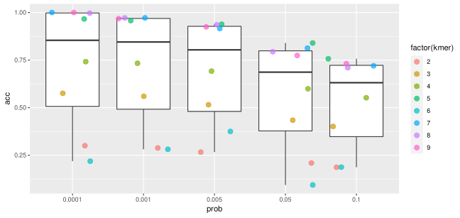

# kmerBloomFilter
A script to extract all kmers appearing more than once in a given genomic sequence in a fasta file using a Bloom filter (a space-efficient probabilistic data structure). It was created for educational purposes. It is inspired by this [article](https://rdcu.be/ckIkj).

